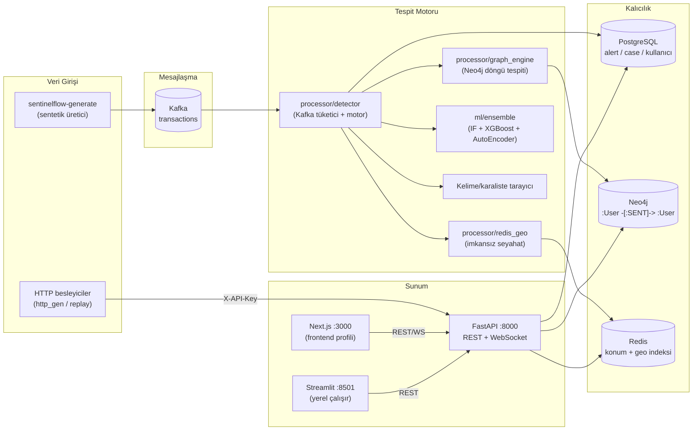

# SentinelFlow Mimari Dokümantasyonu

Bu belge depodaki **gerçek** yapıyı yansıtır. Soyut hedefler değil, çalışan
bileşenler anlatılmıştır.

## 1. Sistem Mimarisi



## 2. Modül Yapısı (gerçek)

```
src/sentinelflow/
├── api/            # FastAPI uygulaması, rotalar, şemalar, risk_scoring
├── auth/           # JWT (python-jose), parola (passlib), rol bağımlılıkları
├── config/         # Pydantic-settings (.env) — Settings grupları
├── contracts/      # Domain Pydantic modelleri (Transaction, Alert, Case, User…)
├── database/       # SQLAlchemy async modeller + PostgreSQL oturumu, Alembic
├── detectors/      # İnce CLI kabuğu (python -m sentinelflow.detectors)
├── generator/      # Sentetik işlem üretici (CLI: sentinelflow-generate)
├── ingestor/       # Kafka → API köprüsü (X-API-Key ile besler)
├── kyc/            # PEP/yaptırım listesi taraması, CDD, risk skoru
├── ml/             # Özellik motoru, ensemble, GNN, temporal, federated/
├── mlops/          # Deney takibi, model registry, drift, A/B, feature store
├── processor/      # Ana motor: detector, graph_engine, redis_geo, alert_writer
├── repository/     # Alert/Case/Event kalıcı katman soyutlamaları
└── dashboard/      # Streamlit operasyon paneli (app.py + i18n)
```

Not: `patterns/`, `core/`, `middleware/`, `security/`, `compliance/`, `monitoring/`
gibi paketler **yoktur**; çalışan işlevler yukarıdaki `processor/`, `contracts/`,
`auth/` ve `kyc/` altında toplanmıştır. Kapsam dışı bırakılan modüller
`archive/unwired-features-20261005` etiketinde saklanır.

## 3. İşlem Akışı

```
İşlem olayı
  ├─ Kafka(topic=transactions) ─→ processor/detector
  │       ├─ graph_engine  → Neo4j döngüsel halka tespiti (3-6 hop, 7 gün)
  │       ├─ redis_geo     → imkansız seyahat (> 900 km/h)
  │       ├─ kelime taraması → şüpheli açıklama kalıpları
  │       └─ ml/ensemble   → anomali skoru + risk ağırlığı
  └─ POST /api/v1/transactions (doğrudan, senkron skor döner)

Toplam risk skoru → alert_writer → PostgreSQL(alert) + Kafka(alerts)
                 → WebSocket /ws/alerts üzerinden canlı yayın
```

## 4. ML Pipeline

Özellik çıkarma (`ml/feature_engine`) 21 boyutlu vektör üretir. Ensemble
oylaması ağırlıklı:

| Model | Ağırlık | Not |
| --- | --- | --- |
| IsolationForest | 0.4 | Denetimsiz anomali |
| XGBoost | 0.4 | Denetimli sınıflandırma |
| AutoEncoder | 0.2 | Yeniden yapılandırma hatası |

Ağır bağımlılıklar (torch, lightgbm, catboost, shap…) **opsiyoneldir**;
kurulu değilse ilgili model devre dışı kalır, motor kalanlarla çalışır
(`ml/models.py`, `ml/advanced_models.py` içinden korumalı import'lar).
GNN (`ml/gnn_model.py`) ve temporal (`ml/temporal_model.py`) modeller eğitim
scriptlerinden çağrılır; federated öğrenme `ml/federated/` altında simüle edilir.

## 5. Graf Analizi (Neo4j)

Gerçek şema (bkz. `scripts/init_neo4j_schema.cypher`, compose'da ilk açılışta
otomatik yüklenir):

- Düğümler: `:User {iban}` — ayrıca `:Account`, `:Transaction`, `:Customer` indeksleri
- İlişki: `(a:User)-[:TRANSACTION]->(b:User)` / motor `:SENT` kenarlarıyla yazar
- Döngü tespiti: `processor/graph_engine.py` içinde `detect_fraud_rings()`;
  APOC kuruluysa prosedür, değilse saf Cypher fallback (`_detect_rings_without_apoc`)

## 6. İzleme (Monitoring)

Bugün **fiilen çalışan**: API'nin `/metrics` uç noktası ve compose'da
`--profile monitoring` ile açılan Prometheus (`config/prometheus.yml`,
`api:8000` hedefini tarar, `config/prometheus_alerts.yml` ile uyarı kuralları).

Zengin izleme paketi (Prometheus collector, OpenTelemetry tracer, JSON logger)
şimdilik kapsam dışı bırakıldı; teker teker, çalışır halde geri eklenecek.

## 7. Güvenlik

- **JWT**: HS256, erişim token'ı 30 dk, refresh 7 gün (`auth/config.py`).
  `JWT_SECRET_KEY` tanımlı değilse uygulama **başlamayı reddeder** (sessiz varsayılan yok).
- **Roller**: `viewer` < `analyst` < `admin`; her korumalı rotada
  `auth/dependencies.py` üzerinden zorlanır.
- **Besleme**: `POST /api/v1/transactions` JWT veya `X-API-Key` kabul eder.
- **Secrets**: yalnızca `.env`/ortam değişkeni (bkz. `.env.example`);
  compose `:?` ile zorunlu tutar.
- **CORS**: `CORS_ORIGINS` beyaz listesi; `*` seçilirse credentials kapanır.
- Şimdilik **rate limiting yoktur** (backlog maddesi).

## 8. Dağıtım

Docker Compose servisleri (bkz. `docker-compose.yml`):
`postgres`, `zookeeper`, `kafka`, `kafka-ui`, `neo4j`, `redis`,
`redis-commander`, `prometheus` (profil: `monitoring`), `api`,
`frontend` (profil: `frontend`).

Streamlit paneli compose dışındadır: `streamlit run src/sentinelflow/dashboard/app.py`.

Kubernetes manifestleri henüz depoda yoktur; CI'ın ürettiği `ghcr.io` imajı
böyle bir dağıtım için hazırlandı.

## 9. Ölçümler

Performans/ölçüm iddiaları için bkz. `docs/benchmark.md` ve `docs/ml_model_cards.md`.
Bu belgeye sabit sayı kopyalamaktan kaçınılır; ölçümler tekrar üretilebilir
script'lerle belgelenir.